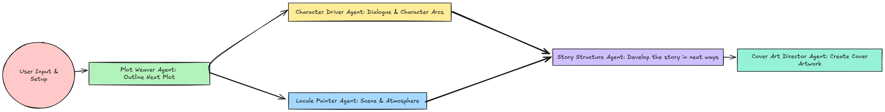

# Personalized Story Agents

This repository demonstrates a simulation using **CrewAI** agents to collaboratively develop a story. We leverage multiple specialized agents, each responsible for a distinct part of the creative process:

1. **Develop Plot**: Use the Plot Weaver agent to create the story’s overall structure.  
2. **Drive Characters**: Have the Character Driver agent flesh out characters’ motivations and dialogues.  
3. **Paint Locale**: Let the Locale Painter agent describe rich settings and festive atmospheres.  
4. **Construct Story**: Merge all elements via the Story Constructor agent into a cohesive narrative.  
5. **Direct Cover Art**: Employ the Cover Art Director agent to produce a final, story-consistent cover image.

---

## Workflow

Below is a simplified workflow diagram showing how the agents interact to produce the final story:

Each agent tackles a specific task, and their outputs flow into subsequent tasks for a fully integrated storytelling experience.

---

## Getting Started

1. **Install Dependencies**  
   - Ensure you have Python 3.9+ and install the required packages in the requirements.txt (e.g., `crewai`).

2. **Set Up Agents**  
   - Define each agent (e.g., Plot Weaver, Character Driver, etc.) with their respective goals, backstories, and language model parameters.

3. **Configure Tasks**  
   - Assign tasks to each agent (plot weaving, character driving, locale painting, etc.).  
   - Optionally specify dependencies (e.g., the Story Constructor might depend on outputs from the Plot Weaver and Character Driver).

4. **Run the Crew**  
   - Create a `Crew` object, register your agents and tasks, and execute sequentially or in parallel.  
   - Observe how each agent’s output informs the next step until the story is fully composed and illustrated.

---

## Contributing

Feel free to open issues or submit pull requests to improve this workflow or add new agents and tasks.

---

## License

This project is provided under the [MIT License](./LICENSE).  
